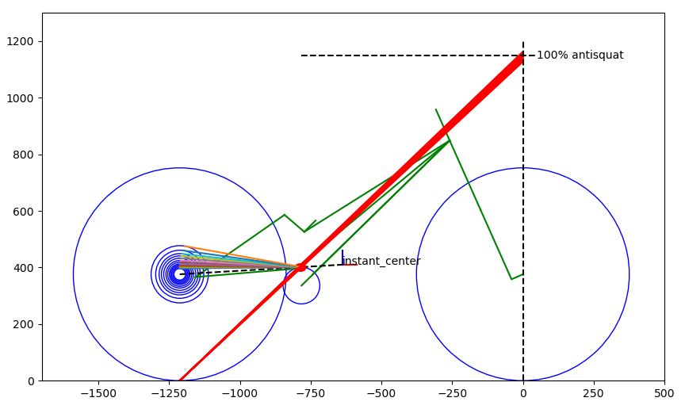

# FsAnalyzer
A work in progress tool for plotting bicycle suspension antisquat and leverage
rate curves

Not much here yet, check back later.




## Installation
This step installs the required `matplotlib` and `numpy` dependencies
if they are not already available on your machine and installs the `fsanalyzer`
package to your python path.
```
git clone https://github.com/shift-dynamics/fsanalyzer
cd fsanalyzer
pip install . --user
```

## Usage
### Run the test program
From the main repo directory, run the test program as:
```
python test/test_draw_antisquat.py
```

### Use in your python code
To use the package in your python code:
```python
#!/usr/bin/env python

from fsanalyzer.kinematics import FsAnalyzer

if __name__ == "__main__":
    fsanalyzer = FsAnalyzer("config.json")
    fsanalyzer.draw()
```
where `config.json` is the path to a json configuration file, see 
`data/example.json` for an example of the syntax.
